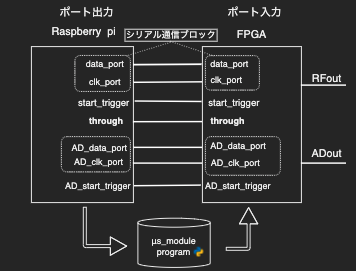
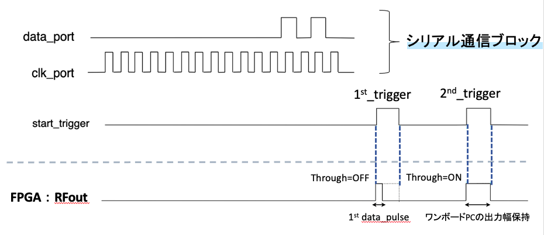
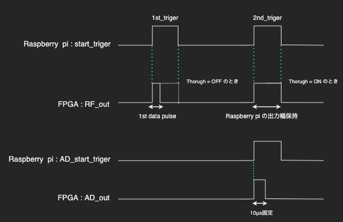
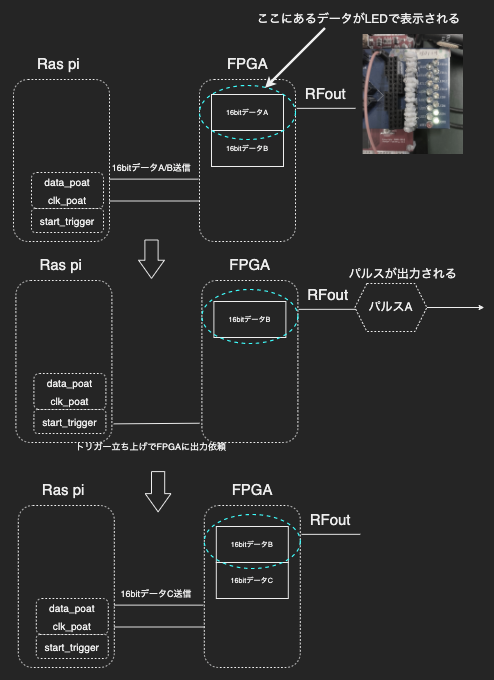
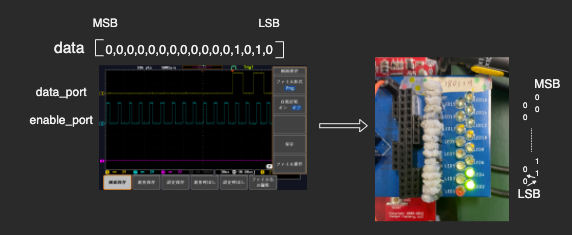

# FPGAと連携したμsオーダーパルス出力機構

# 背景
シングルボードPC単体では、数μsオーダーのパルス出力はできない。そこで、出力側にFPGAを接続し、FPGAにパルス出力を代行させることによって、μsオーダーのパルス出力の実現をはかる。ADパルスはパルスシーケンスにおいてタイミングトリガーの役割を果たすので、本プログラムでも10μsで固定のパルスとする。

<br><br><br>

# 出力機構図
シングルボードPCとFPGAを対応するポート同士を接続する。



<br><br><br>

# 動作概要
1. シリアルブロックでμsオーダーの固定朝16bitデータをFPGAに送信する
2. strat_triggerでFPGAに出力信号を送る
3. ThroughのON/OFFでFPGAを使用するか、使わずシングルボードPCの出力をそのままだすか決定する
<br>




<br><br><br>

# 使用方法
1. シングルボードPCとSerDesを搭載したFPGAの対応するポートをつなぐ。SerDesをつながなくてもできるが、LEDでのデータ一致の確認は行えない。デフォルトで設定されているシングルボードPCのポートは以下の通り
```python:us_pulse_sim.py
data_port = 17
clk_port = 27
start_trigger = 22
ADdata_port = 10
ADclk_port = 9
ADstart_trigger = 11

through_port = 26
```
2. 対応表はこの通り<br>

| Ras pi        | SerDes搭載FPGA               |
| ------------- | ---------------------------- |
| data_poat     | C15                          |
| clk_poat      | C14                          |
| start_trigger | C13                          |
| through_poat  | C12                          |
|               | FPGAからのμsパルス出力 : C11 |

当然だがこれらの他に電源やGNDはRas pi , FPGAそれぞれ別々に、つないでおく必要がある。


3. 以下のプログラムを実行<br>
[us_pulse_sim.py](us_pulse_sim.py)<br>
基本的にはプログラムで表示されるの入力項目をキーボードから入力すれば問題ない<br>


4. start_triggerを合図にオシロスコープ(ノーマルモード)でμsパルス出力を確認
<br><br><br>


# プログラムの説明
本プログラムからのパルス出力は  **ロケット鉛筆方式**  と呼んでいる。まず、FPGAに２回分のパルスデータすなわち、32bitを送信する。スタートトリガー合図に、そのうちの最初の1個のパルスが出力される。そして、次のパルスデータを格納し、その一個前のパルスを出力する。
```python:us_pulse_sim.py
loop_times = int(input("Please enter loop number : "))
```
この部分でパルスの繰り返し回数を入力させているので、指定回数になるまで繰り返す。
これを図で表すと以下の順序で行われている


<br><br><br>


# LEDでのデータ一致確認
入力16bitデータのMSBがLEDの上部から確認できる。画像のデータは1μsのパルスを出力する16bitデータ



# 使用上の留意点
シングルボードPC(ラズパイ)は、基本的にはmsオーダーのパルスしか出せないと考えてもらっていい。そのため、μsのパルスを出力したいときは、ThroughをOFFにするつまり、FPGAを使う。逆に、msのパルスを出したい時は、ThroughをONにして、FPGAは使わずラズパイの出力をそのまま使用と行った方法をとったほうが良い。
<br><br><br>

# Author
専攻科 2021年卒業 応用物理研究室： 横尾杏之介
<br>
共同研究者 : 星野拓真

[GitHub Repository](https://github.com/parupappa/Pine64-python--pulse/tree/master/Pulsesimulator/sim_to_FPGA)
<br>

[Qiita](https://qiita.com/yokoo-an209)